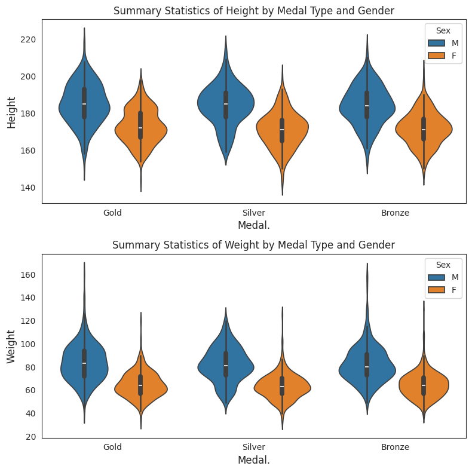
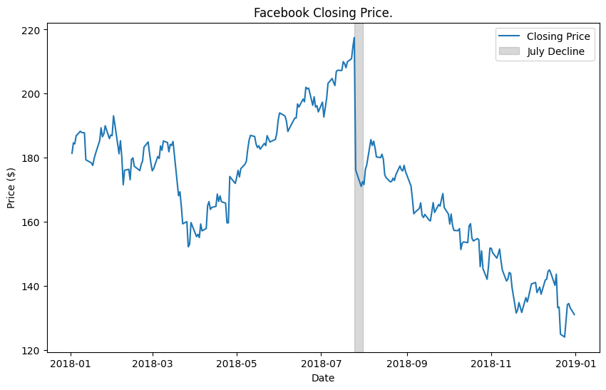
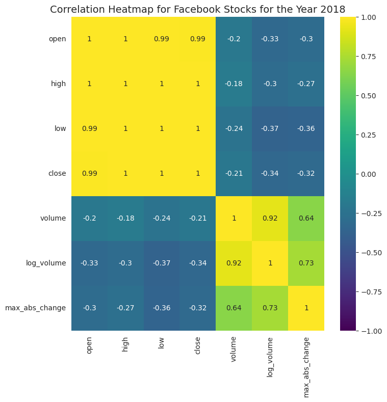

# Python Data Visualization Portfolio

Hi, I'm **Melody Yang**. This repository showcases exploratory data analysis and visualization work in Python across sports, finance, energy, and healthcare data.

The emphasis is on choosing visualizations that match the analytical question, preparing data for clear comparisons, and communicating patterns with both static and interactive charts.

## Featured projects

### 1. Olympic Athlete & Medal Visualization
**Notebook:** [`notebooks/olympic_athlete_visualization.ipynb`](notebooks/olympic_athlete_visualization.ipynb)

Explores Olympic athlete-event records with ranked bar charts, age distributions, scatter plots, violin plots, medal composition, and interactive Plotly comparisons.

**Skills:** Pandas · Matplotlib · Seaborn · Plotly · EDA · distribution analysis



### 2. Facebook (FB) 2018 Stock Visualization
**Notebook:** [`notebooks/facebook_stock_visualization.ipynb`](notebooks/facebook_stock_visualization.ipynb)

Analyzes daily stock movement with time-series charts, event annotation, Tukey fences, engineered features, correlation heatmaps, pairplots, hexbins, and regression views.

**Skills:** time-series visualization · feature engineering · outlier analysis · correlation · multivariate visualization





### 3. Global Renewable Energy Geospatial Visualization
**Notebook:** [`notebooks/renewable_energy_geospatial.ipynb`](notebooks/renewable_energy_geospatial.ipynb)

Uses animated Plotly choropleths to explore renewable electricity production and renewable energy consumption across countries from 2008–2016.

**Skills:** Plotly · choropleth maps · geospatial visualization · data reshaping · animation

### 4. Diabetes Data Cleaning & Feature Engineering
**Notebook:** [`notebooks/diabetes_data_cleaning.ipynb`](notebooks/diabetes_data_cleaning.ipynb)

Demonstrates data-quality checks, zero-coded missing-value handling, mean imputation, feature engineering, and descriptive outcome analysis.

**Skills:** Pandas · NumPy · missing data · imputation · feature engineering

## Technology

- Python
- Pandas
- NumPy
- Matplotlib
- Seaborn
- Plotly
- Jupyter Notebook

## Repository structure

```text
python-data-visualization-portfolio/
├── README.md
├── notebooks/
│   ├── olympic_athlete_visualization.ipynb
│   ├── facebook_stock_visualization.ipynb
│   ├── renewable_energy_geospatial.ipynb
│   └── diabetes_data_cleaning.ipynb
├── assets/
├── data/
├── docs/
├── requirements.txt
└── .gitignore
```

## Data

Datasets are not included in this repository. The notebooks are intended
to demonstrate analysis and visualization workflows, with saved outputs
included where applicable.

## Run locally

```bash
python -m venv .venv
source .venv/bin/activate      # macOS/Linux
# .venv\Scripts\activate     # Windows

pip install -r requirements.txt
jupyter lab
```

Add the required CSV files to `data/`, then run the notebooks from top to bottom.

## Usage

© 2026 Melody Yang. All rights reserved.

This repository is intended for portfolio and demonstration purposes. Please do not reproduce or submit this work as your own.
